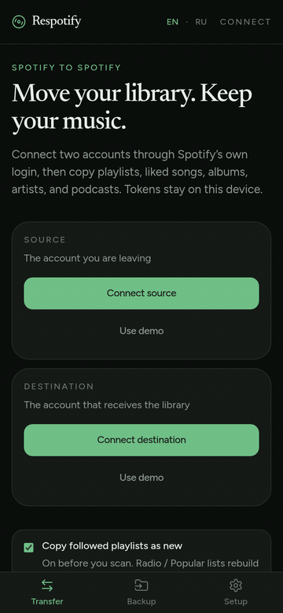
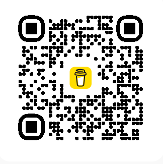
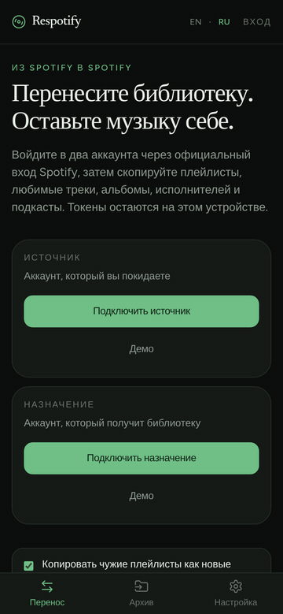

# Respotify

  <a href="#english">English</a>
  ·
  <a href="#russian">Русский</a>

Language stays on this page. Click **Русский** or **English** below.

<strong>English</strong>

Move a Spotify library from one account to another.

Open the app: **[brinza666.github.io/respotifyfree](https://brinza666.github.io/respotifyfree/)**

Android APK: **[GitHub Releases](https://github.com/brinza666/respotifyfree/releases)**

You sign in to Spotify twice — **source** (the account you are leaving), then **destination** (the account that receives the library). On the second login tap **Not you**. Tokens stay in your browser. Nothing is uploaded to our servers.

### Use cases

- Leave a family or student plan and take your playlists with you
- Start a clean Spotify account without losing liked songs
- Keep a JSON backup before you cancel
- Copy Radio / Popular stations that Spotify will not follow, rebuilt from search

### What copies

| Catalog | Copied? |
|---|---|
| Owned playlists (track order kept) | Yes |
| Followed playlists | Follow, or copy as new |
| Liked songs (optional original order) | Yes |
| Saved albums | Yes |
| Followed artists | Yes |
| Podcast subscriptions | Yes |
| Saved episodes | Yes |
| Recently played | Saved as a playlist archive |
| Radio / Popular (hidden by Spotify) | Rebuilt from search when songs can be found |
| Daily Mix / Discover Weekly / Made For You | No — Spotify hides those tracks |
| Listening history / Wrapped / algorithm / followers | No — Spotify has no write API |

### How to use

1. Open [the app](https://brinza666.github.io/respotifyfree/) or install the [Android APK](https://github.com/brinza666/respotifyfree/releases).
2. Tick what to copy **before** you connect. Unticked catalogs are skipped.
3. In **Setup**, paste your Spotify Client ID if it is empty. Add both emails under Users Management.
4. Connect source, then destination.
5. Confirm the list (counts appear after the scan) and start the transfer.
6. Optionally download a `respotify-backup.json`.

The website has a **walkthrough video**. **Run demo transfer** walks the wizard without writing to Spotify.

In **Setup** you can turn on **Show track names** and **Show more info**, switch English / Русский, and download the APK.

Auth is official Spotify OAuth (Authorization Code + PKCE). Cookie or password capture is not supported.

### Phone

- Chrome: menu → **Add to Home screen**
- Android APK: [Releases](https://github.com/brinza666/respotifyfree/releases) (sideload; enable unknown sources if asked)
- Login still uses Spotify’s own page

The `gh-pages` branch is only the published website. Edit source on `main`.

### Support

You get the library. I get one coffee. The unicorn gets its playlists back. Probably...

- [Buy me a coffee](https://www.buymeacoffee.com/brinza)
- [PayPal](https://paypal.me/brinza666)

### Privacy

Client ID is a public OAuth identifier. Access tokens never leave your device. Respotify is not affiliated with Spotify. Use it with your own Spotify Developer app and respect the [Spotify Developer Terms](https://developer.spotify.com/terms).

<strong>Русский</strong>

Перенос библиотеки Spotify с одного аккаунта на другой.

Приложение: **[brinza666.github.io/respotifyfree](https://brinza666.github.io/respotifyfree/)**

Android APK: **[GitHub Releases](https://github.com/brinza666/respotifyfree/releases)**

Вы входите в Spotify дважды — **источник** (аккаунт, который покидаете), затем **назначение** (аккаунт, который получит библиотеку). На втором входе нажмите **Not you**. Токены остаются в браузере. На наши серверы ничего не уходит.

### Зачем это нужно

- Уйти с семейного или студенческого тарифа и забрать плейлисты
- Завести чистый аккаунт, не потеряв любимые треки
- Сделать JSON-архив перед отменой подписки
- Скопировать станции Radio / Popular, на которые Spotify не даёт подписаться — они собираются поиском

### Что копируется

| Раздел | Копируется? |
|---|---|
| Свои плейлисты (порядок треков сохраняется) | Да |
| Чужие плейлисты | Подписка или копия как новый список |
| Любимые треки (можно сохранить исходный порядок) | Да |
| Сохранённые альбомы | Да |
| Подписки на исполнителей | Да |
| Подкасты | Да |
| Сохранённые эпизоды | Да |
| Недавно проигранное | Архивный плейлист |
| Radio / Popular (скрыто Spotify) | Сборка поиском, если треки находятся |
| Daily Mix / Discover Weekly / Made For You | Нет — Spotify скрывает эти треки |
| История, Wrapped, алгоритм, подписчики | Нет — у Spotify нет API записи |

### Как пользоваться

1. Откройте [приложение](https://brinza666.github.io/respotifyfree/) или установите [Android APK](https://github.com/brinza666/respotifyfree/releases).
2. Отметьте, что копировать, **до** входа. Снятые разделы не сканируются.
3. В **Настройке** вставьте Spotify Client ID, если поле пустое. Добавьте оба email в Users Management.
4. Подключите источник, затем назначение.
5. Проверьте список (после скана появятся числа) и запустите перенос.
6. При желании скачайте `respotify-backup.json`.

На сайте есть **видео-обзор**. **Демо-перенос** показывает мастер, ничего не записывая в Spotify.

В **Настройке** можно включить **Показывать названия треков** и **Показывать подробности**, переключить English / Русский и скачать APK.

Вход — официальный OAuth Spotify (Authorization Code + PKCE). Перехват cookie или пароля не поддерживается.

### Телефон

- Chrome: меню → **Добавить на главный экран**
- Android APK: [Releases](https://github.com/brinza666/respotifyfree/releases) (установка из неизвестных источников, если система спросит)
- Вход по-прежнему идёт через страницу Spotify

Ветка `gh-pages` — только опубликованный сайт. Править исходники нужно в `main`.

### Поддержать

Вы получаете библиотеку. Я — один кофе. Единорог — свои плейлисты. Все в Плюсе, наверное.

- [Купи мне кофе](https://www.buymeacoffee.com/brinza)
- [PayPal](https://paypal.me/brinza666)

### Приватность

Client ID — публичный идентификатор OAuth. Токены доступа не покидают устройство. Respotify не связан со Spotify. Используйте своё приложение в Spotify Developer Dashboard и соблюдайте [условия разработчика Spotify](https://developer.spotify.com/terms).

