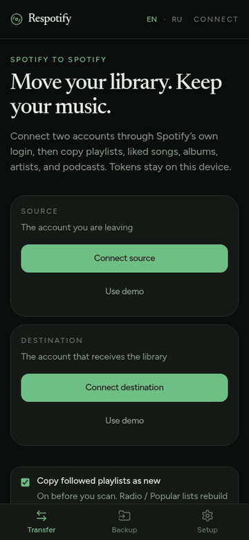

# Respotify

**English** · [Русский](README.ru.md)

Move a Spotify library from one account to another.

Open the app: **[brinza666.github.io/respotifyfree](https://brinza666.github.io/respotifyfree/)**

Android APK: **[GitHub Releases](https://github.com/brinza666/respotifyfree/releases)**

You sign in to Spotify twice — **source** (the account you are leaving), then **destination** (the account that receives the library). On the second login tap **Not you**. Tokens stay in your browser. Nothing is uploaded to our servers.

## Use cases

- Leave a family or student plan and take your playlists with you
- Start a clean Spotify account without losing liked songs
- Keep a JSON backup before you cancel
- Copy Radio / Popular stations that Spotify will not follow, rebuilt from search

## What copies

| Catalog | Copied? |
|---|---|
| Owned playlists (track order kept) | Yes |
| Followed playlists | Follow, or copy as new |
| Liked songs (optional original order) | Yes |
| Saved albums | Yes |
| Followed artists | Yes |
| Podcast subscriptions | Yes |
| Saved episodes | Yes |
| Recently played | Saved as a playlist archive |
| Radio / Popular (hidden by Spotify) | Rebuilt from search when songs can be found |
| Daily Mix / Discover Weekly / Made For You | No — Spotify hides those tracks |
| Listening history / Wrapped / algorithm / followers | No — Spotify has no write API |

## How to use

1. Open [the app](https://brinza666.github.io/respotifyfree/) or install the [Android APK](https://github.com/brinza666/respotifyfree/releases).
2. In **Setup**, paste your Spotify Client ID if it is empty. Add both emails under Users Management.
3. Connect source, then destination.
4. Leave **Copy followed playlists as new** on (connect screen, before the scan).
5. Pick catalogs and start the transfer.
6. Optionally download a `respotify-backup.json`.

A **demo transfer** walks the wizard without writing to Spotify.

In **Setup** you can turn on **Show track names** and **Show more info**, switch English / Русский, and download the APK.

Auth is official Spotify OAuth (Authorization Code + PKCE). Cookie or password capture is not supported.

## Phone

- Chrome: menu → **Add to Home screen**
- Android APK: [Releases](https://github.com/brinza666/respotifyfree/releases) (sideload; enable unknown sources if asked)
- Login still uses Spotify’s own page

The `gh-pages` branch is only the published website. Edit source on `main`.

## Privacy

Client ID is a public OAuth identifier. Access tokens never leave your device. Respotify is not affiliated with Spotify. Use it with your own Spotify Developer app and respect the [Spotify Developer Terms](https://developer.spotify.com/terms).
